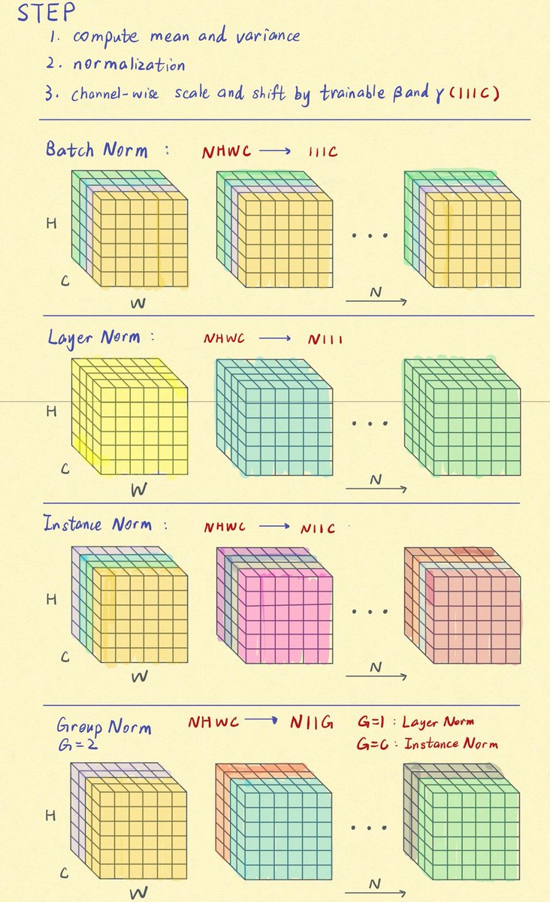
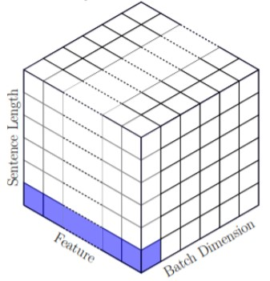
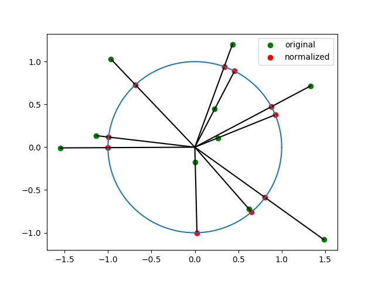
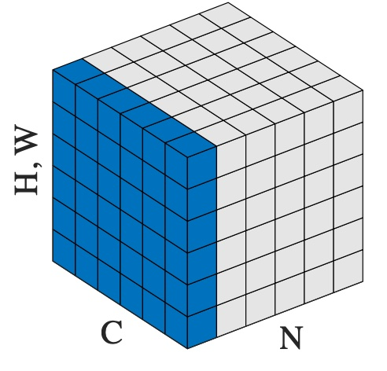
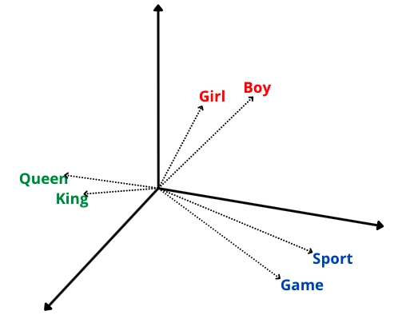

+++
title = 'Normalization'
date = 2024-04-30T17:47:33+08:00
draft = false
+++

如果是对二维有形式下的各种归一化方式有混淆的，可以参看下面对于 **CV** 任务的全局概览

<!-- 

    

        
         
        	<b>2d Norm 概览</b>
         
        	<i>https://twitter.com/Xu_Cao_/status/1054634647945015296</i>
    

 -->

## Batch Norm

Batch Norm

## Layer Norm

### 一维形式

对于 NLP 任务的 **一维** embedding，每一个 token 就是不同的 feature。

<!-- 

    

        
         
        	<b>Layer Norm</b>
       	 
        	<i>https://proceedings.mlr.press/v119/shen20e/shen20e.pdf</i>
    

 -->

对同一个 token 位置的所有 feature 进行归一化操作。相当于是把原本长短不一的向量都拉长或缩短到了一个 n 维空间中的球上，n 就是 feature 的维度。不同的 embedding 就是指向角度不同的向量。比如下面这个是二维空间中的形式

<!-- 

    

        
         
        	<b>2d Normalization</b>
       	 
        	<i>https://blog.csdn.net/root_clive/article/details/89373471</i>
    

 -->

### 二维形式

对于 CV 任务的 **二维** embedding，因为单看某个位置的像素其实并没有具体的意义，还需要整张图进行理解，所以往往会将整张图看成一个 $H \times W$ 的feature。不同的 channel 才是不同的 feature。

<!-- 

    

        
         
        	<b>Layer Norm</b>
         
        	<i>https://arxiv.org/abs/1803.08494</i>
    

 -->

上面的图相当于一维 Layer Norm 的图绕着垂直于 $feature \times length$ 面的轴旋转90°的结果，channel 数就相当于一维中的 sequence_length。所以二维的 Layer Norm 是对一整张 feature map 去计算均值（mean）和方差（std），然后进行归一化。所以如果输入的 tensor 的维度为 `[Batch, Channel, Height, Width]` (N, C, H, W)，则计算为：
$$
y= \frac{x−E[x]}{Var[x]+ϵ}∗γ+β, \qquad all ~ x ~ with ~ same ~ N ~ index
$$
Layer Norm 是在每个样本中，对所有的 channel 和 feature 进行归一化。对于 NLP 任务，就是每个 token (channel) * embedding (feature) 上作归一化。 对于 CV 任务，则是对每一个 channel * feature map 作归一化。

### 作用

Layer Norm 把特征进行归一化，使得原本各feature之间的差异进一步放大，形成各多样的表示，从而利于模型的学习。

比如说，输入的 feature 是 `[0.001, 0.008, 0.003]` 。对于下一层来说输入值都在 `0` 附近，那么每个下一层的输出哪怕每一个 feature 的权重不一样，输出的差别也很小。
但是如果使用 Layer Norm 对 feature 进行归一化。整个向量就变成了 `[0.08, 0.067, 0.025]` 这样所有分量之间的差异就变大了。

但是这里存在一个问题，这么做的前提条件是 feature 各分量之间仅只有相对大小关系存在意义，而绝对值的大小并没有被模型所捕获。

<!-- 

    

        
         
        	<b>Semantic Vector</b>
         
        	<i>https://www.tizi365.com/topic/3987.html</i>
    

 -->

也就是说 feature 实际上是在 space 空间中的一个向量。仅有向量的指向具有明确意义，向量的模长是无意义的。这样的归一化方式在 NLP 的 embedding 空间中是合理的，实验效果也不错，但是在每个 feature 绝对值大小有特殊含义的表征上就不是很合理。比如一张纯黑和纯白的图，过 Layer Norm 后都是一致的，但是却显示不了差别，就丧失了部分信息。

按理说，强化学习 (Reinforcement Learning, RL) 的输入 feature 使用 Batch Norm 针对每个 feature 单独归一化似乎更合理。因为输入的 state 往往是具有一定的物理含义。所以其绝对值的范围相差比较大，Layer Norm 容易出现小绝对值的量被大绝对值的量所 “淹没” 的情况。
比如 `[血量, x坐标, y坐标]` ，由于`血量`的值可能在 `[0, 100]` 范围内，而`坐标` 在 `[0, 1]` 范围内。之就会导致 Layer Norm 会一直得到一个近似于 `[1, 0, 0]` 的向量。
但是如果是 Batch Norm，则网络是和当前位置的其它值进行比较，则不会出现 feature 之间的相互淹没。

但是实验却发现，RL 使用 Batch Norm 的效果并不好。一种解释是 Batch Norm 需要一个稳定的分布进行输入，而 RL 由于在策略未学好之前，一直在进行探索。所以其输入的分布是极其不稳定的。因而导致 Batch Norm 学到的统计量也十分不稳定。

## Instance Norm

## Group Norm

## RMS Norm

同时，Normalization 也把输出的模长归一化，使得梯度不会在

## Reference

1. [Group Normalization](https://arxiv.org/abs/1803.08494) 
2. [PowerNorm: Rethinking Batch Normalization in Transformers](https://proceedings.mlr.press/v119/shen20e/shen20e.pdf) 