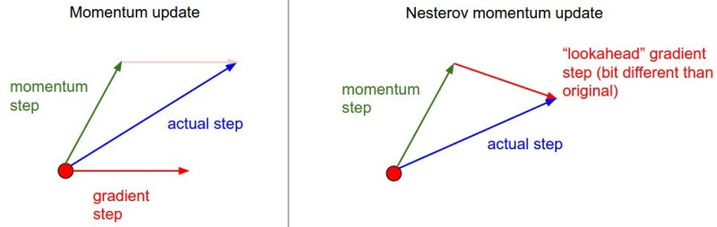

+++
title = 'Optimizer'
date = 2024-05-06T15:24:53+08:00
lastmod = 2024-05-06T15:24:53+08:00 #更新时间
draft = true

tags = ["Deep Learning", "AI","Optimizer"]
categories = ["Artifical Intelligence", "Deep Learning"]

+++

深度学习是通过构建目标（Target），然后计算目标与输出（Output）的误差（也被称为损失 Loss）来进行迭代式优化的。优化时，需要依赖不同的优化器（Optimizer）。这篇文章就整理一下不同优化器的理论以及特性。

## SGD

SGD 全称是 Stocastic Gradient Descent，随机梯度下降，由梯度下降方法发展。梯度下降法的更新方式为：
$$
\theta_k \leftarrow \theta_{k-1} - \alpha  \frac{1}{N} \sum_{i=1}^{N}\nabla_{\theta_{k-1}} J_{i}(y_{pred},y_{tar})
$$
其中 $\theta$ 是优化目标参数，k 是优化次数， $\alpha$ 是迭代步长，N 是样本个数，$J$ 是损失函数。可见，其是在第 k 轮根据 n 个样本上损失对于 k-1 轮参数求导的梯度和来更新参数。

但是这样的方法有个弊端，样本个数无法做到太大，因为每一次需要把所有的样本都计算一遍。一个很简单的想法就是每次对样本做一个均匀采样，只计算其中一部分样本的损失梯度和，这样在期望上仍然是相等的。更专业一点说，这是个对完整梯度的无偏估计。这就是随机梯度下降：
$$
\theta_k \leftarrow \theta_{k-1} - \alpha  \frac{1}{n} \sum_{i=1}^{n}\nabla_{\theta_{k-1}} J_{i}(y_{pred},y_{tar})
$$

## Momentum

    
    <b>Optimizer in a Saddle Point</b>
     
        

      		<i>https://cs231n.github.io/neural-networks-3/</i>
  		

可以看到，在一个鞍点（Saddle Point）由于梯度比较小，SGD会非常难以逃离这样的区域，这样就发展了带动量的方法。

Momentum 的方法非常简单，就是增加了一个动量项——曾经更新的方向很有可能还是一个好方向，所以要不断累积：
$$
\begin{align}
M_{k} &= \beta M_{k-1} + (1-\beta) \nabla_{\theta_{k-1}} J\\
\theta_k &= \theta_{k-1} - \alpha M_{k} 
\end{align}
$$
其中 $M_k$ 是计算的当前第 k 轮的动量平均梯度，$\beta$ 是平滑梯度时所用的超参数。

但是实际计算中大概会忽略掉 $(1-\beta)$ 这一项，直接做权值衰减：
$$
\begin{align}
M_{k} &= \beta M_{k-1} + \nabla_{\theta_{k-1}} J\\
\theta_k &= \theta_{k-1} - \alpha M_{k} 
\end{align}
$$
为什么这么做可以呢？因为反正也要调整 $\alpha$ ，那不如把 $(1-\beta)$ 直接吸收进去，还能让参数组合更灵活一些，让 $M_{k-1}$、$ \nabla_{\theta_{k-1}} J$ 的权重和不必一定是1）

动量项可以缓解 SGD 的振动（oscillation）问题，其积累的梯度也能够让优化参数快速脱离鞍点。

但是动量可能带来的问题就”是容易冲过了“

    
    <b>Optimizer</b>
     
        

      		<i>https://cs231n.github.io/neural-networks-3/</i>
  		

可以看到绿色的 Momentum 一开始冲向了一个错误的方向，很远才修正回来。

## Nesterov Momentum

    
    <b>Nesterov Momentum Optimizer</b>
     
        

      		<i>https://cs231n.github.io/neural-networks-3/</i>
  		

Nesterov 比一般的动量多考虑了一步：既然我指数平均的动量是可以提前算出来，那我当前步的梯度为什么还要是沿着平均之前的位置计算呢？所以直接修改为对平均后的参数进行求导可能会更准确。

对比一下 Standard Momentum：
$$
\begin{align}
\textcolor{blue}{M_{k}} &= \beta \textcolor{green}{M_{k-1}} + \textcolor{red}{\nabla_{\theta_{k-1}} J}\\
\theta_k &= \theta_{k-1} - \alpha \textcolor{blue}{M_{k}}
\end{align}
$$
把 $\alpha$ 吸收进第二行然后运用 Nesterov 的思想可得：
$$
\begin{align}
\tilde{\theta}_{k} &= \theta_{k-1} + \gamma \textcolor{green}{N_{k-1}} \\
\textcolor{blue}{N_{k}} &= \gamma \textcolor{green}{N_{k-1}} - \alpha\textcolor{red}{\nabla_{\tilde{\theta}}J}\\
\theta_k &= \theta_{k-1} + \textcolor{blue}{N_{k}}
\end{align}
$$
这个方法就叫做 Nesterov’s Accelerated Momentum (NAG)。

它在凸优化的时候效率更好，一般问题下比 Momentum 的好一点。

补充资料：

[从变分法的角度看Nesterov加速算法](https://zhuanlan.zhihu.com/p/202748353) 这篇文章提供了一个另外的看 Nesterov 的视角

[比Momentum更快：揭开Nesterov Accelerated Gradient的真面目](https://zhuanlan.zhihu.com/p/22810533) 这里讲述了 Nesterov 的等价形式，以及两种形式之间的推导

## AdaGrad

实际上所有的特征我们遇到的频率并不一致，有些特征可能很常见，所以已经收敛得较好了，有的特征可能不太常见，所以还未怎么收敛。这么来看，所有都用同样的步长是有问题的。

所以可以把学习率从$\frac{\alpha_0}{\sqrt{t + c}}$ 改变为 $\frac{\alpha_0}{\sqrt{s(i,t) + c}}$ 其中 $s(i,t)$ 是到 t 时刻观察到 i 的次数。

这个计数器还是有些粗糙，可以用之前观察所得到的梯度的平方和来衡量会更准确：
$$
s_{t} = s_{t-1} + (\nabla J)^2
$$
然后：
$$
\theta_t = \theta_{t-1} - \frac{\alpha_0}{\sqrt{s_{t} + c}} \cdot \nabla J
$$
也就是说，如果之前的梯度很大，说明现在这个位置比较陡峭，小心试探。如果之前梯度较小，说明现在比较平坦，学习率就可以高一些。

AdaGrad 的缺陷就是随着更新次数增加，学习率会越来越小。也就是说如果一步没跟上，那就可能越来越走不动了。

具体的 AdaGrad 的分析可以参考[Duchi *et al.*, 2011](https://zh-v2.d2l.ai/chapter_references/zreferences.html#id36) 

## RMSProp

因为 AdaGrad 学习率会越来越小，所以考虑不写成梯度相加，而是写成动量平均的形式：
$$
\begin{align}
s_{t} &= \gamma s_{t-1} + (1-\gamma)(\nabla J)^2 \\
\theta_t &= \theta_{t-1} - \frac{\alpha_0}{\sqrt{s_{t} + c}} \cdot \nabla J
\end{align}
$$
所以这个和 AdaGrad 很像。

## AdaDelta

## Adam

## AdamW

## ZeRO

## LARS

LARS 全称是 Layer-wise Adaptive Rate Scaling，是一种专门设计用于大规模批量训练的优化器。它通过在层级上自适应地缩放学习率 来平衡不同层级的梯度更新速度，从而提高模型的训练效率和性能。

LARS 的起源是有人发现网络中不同层权重和梯度的 L2 范数比值 $\frac{\Vert{w}\Vert}{\Vert \nabla L(w_i)\Vert}$ 存在显著的变化。而固定的全局学习率如果和这个比值差异较大，就可能导致训练不稳定，所以就想为每层分配不同的学习率。
$$
\Delta x^{i} = \alpha_0 * \gamma^{i} * \nabla L(x^{i})
$$
其中：
$$
\gamma^{i} = \frac{\Vert x^{i} \Vert}{\Vert \nabla L(x^{i}) \Vert}
$$
这样每次更新的幅度就不再和梯度的模长相关了，所以也能缓解梯度消失和梯度爆炸问题。可以写成动量 SGD 形式：
$$
\begin{align}
m_{t} &= \beta m_{t-1} + (1-\beta)(\nabla L(x_{t}) + \lambda x_{t}) \\
x^{i}_{t} &= x^{i}_{t} - \alpha_0 \frac{\Vert x^{i}_{t} \Vert}{\Vert \nabla L(x^{i}_{t}) \Vert} m_{t}^{i}
\end{align}
$$

## LAMB

LAMB 就是结合了 LARS 和 Adam 的优势得到的优化器。

## Ref

[1] [CS231n Convolutional Neural Networks for Visual Recognition](https://cs231n.github.io/)

[2] 实战AI大模型-尤洋著
