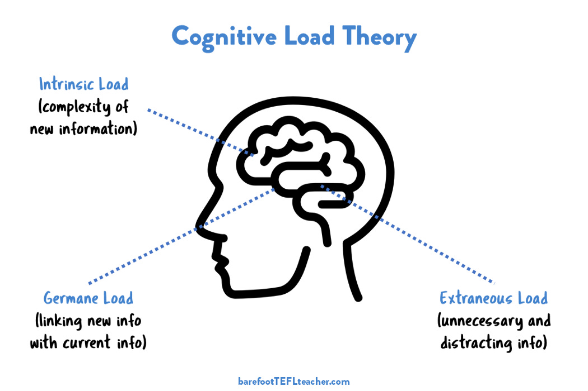


“让别人明白你做了什么”和“你做了什么”一样重要


## 前言

随着模型尺度与技术的发展，LLM 的各项能力都在飞速提升，代码能力也不例外。


<center style="color:#C0C0C0">Close AI 的 GPT、Anthropic AI 的 Claude 和 Google 的 Gemini 最新发布的模型随着时间演进在多个 Benchmark 上平均分的提升</center>

更何况，代码相对于人类语言而言，其更加"规整"

Cursor 的创始团队 Anysphere 也说**代码的”可预测性“是更高的**

> There’s this interesting thing where if you look at language model loss on different domains, I believe the bits per byte, which is a kind of character normalize loss for code is lower than language, which means in general there are a lot of tokens in code that are super predictable, a lot of characters that are super predictable. 
> 
> --<[Cursor Team: Future of Programming with AI | Lex Fridman Podcast #447](https://www.youtube.com/watch?v=oFfVt3S51T4)>

我们越来越信任模型对已有代码的修改。
因此，我们也可以把代码推荐进行一定程度“升级”——从【续写】进化到【改写】。

## 续写与改写

首先看一下续写和改写的差异。

### 续写

定义为：在当前光标之后，为用户推荐一串字符串，使得用户可以通过采纳模型所推荐的字符串而减少自身的键入次数。
一个典型场景是：


其中模型在 紧贴光标 后为用户推荐了 `Promise` 这一串字符。

### 改写

改写是通过模型对一定范围内的代码原文进行修改，直接进行替换。
改写作为续写的超集，其具备比续写更加广阔的能力，其场景较续写多了不少:

#### 1. 续写式新增

   模型的修改可以恰好是在 光标后 增加了一串字符。其展现形式同上。

#### 2. 纯新增

   这里特指非续写的纯新增，一个典型的场景如下：

   

   新增可以在光标附近几行内 **任意位置** 增加字符

#### 3. 纯删除

   

   可以在光标附近几行内任意位置 **删除** 一些字符

#### 4. 修改

   

   对附近写错的内容进行更正（如上图中的 raed 修改为 read）

可见，**【改写】除了覆盖【续写】的光标后纯新增场景外，还新增了另外三种推荐结果**，这也就是前文所说的“其具备比续写更加广阔的能力”。

## 认知负荷与信息熵

当原本的续写交互进入到改写阶段时，我们面临一些新的挑战。

其中之一便是：**删改太多时，如果展示得不好就会显得很乱，让人无法快速明白模型的修改逻辑。** 比如下图所示


为什么会让人难以快速理解？这涉及到认知负荷与信息熵。

### 认知负荷

认知负荷的理论研究最初来源于脑力负荷或心理负荷的诸多研究成果。国际上对脑力负荷或心理负荷的研究最早的是美国心理学家米勒(Miller)，1956 年就开始了这方面的研究。



认知负荷理论认为人脑包含三种资源：

1. 长时记忆资源
2. 工作记忆资源
3. 注意力资源

并将利用这三种资源进行两种信息加工：

1. 控制加工
2. 自动加工

三种资源结构类似于计算机的硬盘、内存和CPU寄存器（忽略掉cache等内容）

**长时记忆**是信息的贮存场所，其容量可视为无限，它贮存的信息必须被提取到工作记忆中才能被加工。

**工作记忆**是信息加工的主要场所，其容量极为有限；

而**注意力资源**更加有限，其实真正对信息进行控制加工的位置。

两种加工的区别则在于：控制加工是一个有意识的序列性的加工过程，速度较慢，需要占用注意资源；自动加工是一个快速的、自动的并行加工过程，可不经意识的控制而发生，几乎不占用注意资源。


**减轻认知负荷，便是以更好的方式组织信息，能够让大脑在有限的资源里处理更多的信息。**


认知负荷又包含三个细分种类

#### 内在认知负荷

第一种认知负荷来源于**学习材料本身的性质**。

如果学习材料所包含的元素间的关联度较低，给学习者带来的认知负荷就较低；反之，如果学习材料包含的元素之间的关联度较高，给学习者带来的认知负荷就较高。

这种负荷我们称其为**内在认知负荷**（Intrinsic cognitive load），是指由学习材料的难度水平带来的负荷。**内在认知负荷指的是学习材料的复杂性超出学习者经验水平所带来的负荷**。

上面这段表述比较抽象，换一个角度说，如果一个信息加工过程需要多个无法归纳、没有共性的元素时，这个信息本身就是困难的。

例如，有 100 个毫不相关参数的函数，想要理解其处理逻辑，大概率会比有 2 个参数的函数其处理逻辑更困难。这是由认知对象本身的复杂性决定的。

#### 外在认知负荷

第二种认知负荷来源于**学习材料的呈现方式**。

学习材料的呈现方式及其所要求的学习活动，也会带来认知负荷。当这种负荷是不必要的因而干扰图式的获得和自动化时，就是外在认知负荷（Extraneous cognitive load）。外在认知负荷是由与学习过程无关的活动引起的，不是学习者建构图式所必需的，因而又称无效认知负荷（Ineffective cognitive load）。

通俗来说，就是展现形式会是否会让用户能依据其特性与共性，利用归纳与推理，重建信息加工的自动化过程。

如果**面对一个新信息时，能把他转换类比为你已经熟悉的知识结构，那么你的学习将变得更轻松**。

#### 关联认知负荷

第三种负荷来源于**学习者的已有经验**。

当学习者头脑中具备充足的与学习内容相关联的图式，并且这些图式已经达到高度自动化的程度时，就会迅速**把当前所面对的信息整合进已有图式中，从而减少信息加工单元的数量，降低学习过程中的认知负荷**。

如果认知任务要求较低（带来的内在认知负荷较低），使得学习者还有充分的认知资源可用，这时他就可以投入额外一些认知资源来促进图式的建构。这种在建构图式时不是必须但投入后又有利于图式建构的认知负荷，就是**关联认知负荷**。

也就是说，**对于当前的学习内容，我们还会进行一定的加工处理**（类似于学习后的总结归纳），这将有助于后续认知别的内容时降低外在认知负荷。

这一负荷往往是由用户自己主动发起的，所以我们暂时不考虑。

#### 总结

因为我们无法改变内在认知负荷（信息的固有复杂度），所以我们需要**尽可能的降低外在认知负荷**。

具体而言，便是**要将用户将要认知的内容组织成其已有且熟悉的知识图式的形式**。

> 在此推荐一篇软件设计里关于认知负荷的文章：[Cognitive load is what matters](https://minds.md/zakirullin/cognitive)

### 信息熵

以上是从认知理论的角度出发，另一个更熟悉的角度是信息论。

如果我们已有的知识的信息为 \(P\)，其将要去认知的信息为 \(Q\) 。那么我们实际认知 \(Q\) 的过程并不需要去完全重新构建 \(Q\) 的信息。根据如下公式：


$$
H(Q|P) + I(P,Q) = H(Q)
$$

可知，我们可以利用已有信息 \(P\) 和 \(Q\) 的关联（也就是他们之间的互信息 \(I(P,Q)\) ）通过认知 \(P\) 所未包含的 \(Q\) 的信息 \(H(Q|P)\) 增量式的构建信息 \(Q\)。

换言之，我们实际要新去认知的内容的信息熵 \(H(Cog)=H(Q|P)\)为

$$
H(Cog) = H(Q) - I(P,Q)
$$

因此易见，当 \(H(Q)\) 认知对象的固有复杂度一定时，已有信息 \(P\) 和 \(Q\) 的关联越大，也就是他们之间的互信息 \(I(P,Q)\) 越大，我们需要新认知的内容 \(H(Cog)=H(Q|P)\) 就越小。


**当需要认知的对象和用户的已有知识关联性越大时，用户的认知负荷越小。**


## 降低认知负荷

如何有效降低用户的认知负荷？在续写转改写这一场景下，取决于多个因素：

1. 交互的展示形式
2. diff 算法
3. 模型推理

### 交互的展示形式

幽灵字符就是续写场景下的一种非常优秀的展示形式，通过字体颜色（有些方案还包括字体/字间距的修改）来区分原始代码与新增代码。

但是这样的**幽灵字符仅适用于新增，所以仅能覆盖前两种场景。而遇到了删除和更改变毫无办法。**

### Diff 算法

**好的 Diff 算法也能提升人对变动的理解效率。**

一个简单粗暴的 Diff 算法是：把所有变动都视为，删除了所有原文，再新增了所有变动后内容，即：

```diff
a
a
a
转变为 ->
b
a
a
a
c

可以视为
-1|a
-2|a
-3|a
然后再
+1|b
+2|a
+3|a
+4|a
+5|c
```

但是**这样的 Diff 算法毫无意义**。

这样的 Diff 没有利用上原文所含的信息量，也就没有减少变更的信息量。因此**这样的 Diff 无法减少用户对于变更的认知负担**。


Diff 应该对原始字符串用尽可能少的操作（删除和插入）得到新的字符串新的


再举个例子，存在

* a: ABCABBA
* b: CBABAC

那么计算 a 到 b 的 Diff 时，可以有如下结果

```diff
1.
- A
- B
  C
- A
  B
+ A
  B
  A
+ C

2.
- A
+ C
  B
- C
  A
  B
- B
  A
+ C

3.
+ C
- A
  B
- C
  A
  B
- B
  A
+ C
```

这三种 Diff 的变更数量都一样，但是 2 和 3 也明显不如 1。

*（其实这里有人认为 2 比 3 要好，因为他们认为**先删除后新增可以看做“替换”**，会比新增后删除更明显。不过我觉得差异不是特别大）*


整块的删除然后新增，比删除新增交叉在一起要好


更加明显的例子是：

```diff
Good:
- one
- two
- three
+ four
+ five
+ six
      
Bad:
- one
+ four
- two
+ five
+ six
- three
```

因此有必要深入了解一下 Diff 算法。

当前主流 Diff 算法的详细内容，会后续写再写一篇文章，敬请期待~😉

### 模型推理

模型推理也需要更加契合人类的编程思路/理解思路。

换言之，对模型的推荐提出了更高的要求：**不但要能推出用户想写的代码，最好还要能够根据用户的理解能力分批推荐，一步一步地为用户展示出代码的构建过程，最终呈现所推荐代码的终态。**

比如，新写一个复杂的业务实现。虽然模型可能有能力直接生成整个代码。但是在模型推荐辅助的编程过程中，可能将原本的代码拆分为：框架构建 -> 子功能拆解 -> 子功能实现 -> 更细功能拆解与实现

可能会更容易让用户快速理解这段推荐的意图，从而提高用户的采纳率。

*（当然，这只是模型推荐辅助编程的场景。智能体直接构建整个项目的场景是另一种人机协同模式）*

## Reference

[1] https://x.com/sammcallister/status/1803791750856634873/photo/1

[2] https://www.youtube.com/watch?v=oFfVt3S51T4

[3] https://www.icu.cn/?p=6408

[4] https://www.victorchu.info/posts/c970017b/

[5] https://blog.jcoglan.com/2017/02/12/the-myers-diff-algorithm-part-1/