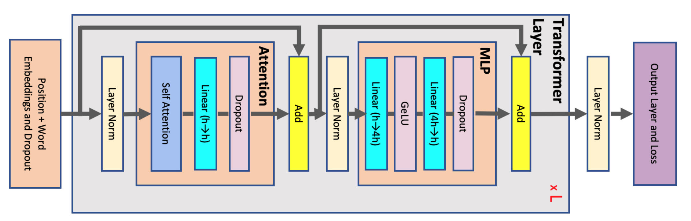
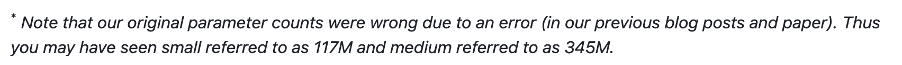
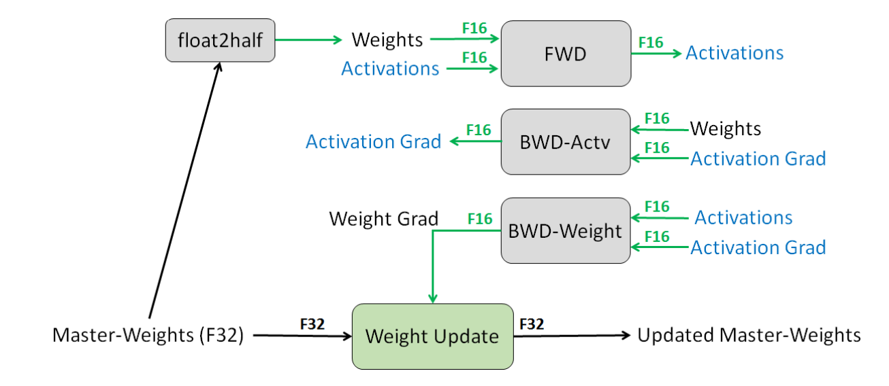
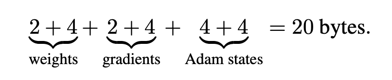


谋定而后动，知止而有得。

——《孙子·计篇》





## 前言

无论是在训练还是推理阶段，我们都需要知道模型的参数量、占用显存、计算量等指标从而匹配相应的资源。

一个最简单的办法当时是直接试一下，看看能用多少。
直接依赖于对应的工具，如 Deepseed 的 Flops Profiler 等工具



（详情可以参看[教程](https://www.deepspeed.ai/tutorials/flops-profiler/)）

但是有的时候，我们总是需要进行事前估计而进行可行性分析的。因此，事前进行一定程度的理论估计是很有必要。

因为现在 LLM 主流都是 Transformer 架构，本文因篇幅原因，只对 Transformer 架构进行了对应估计。
其余结构的参数量，比对此过程应该也可以做大致的分析。

## 模型参数量

首先我们可以先估计一下模型的参数量。

上图是 Transformer 的模型结构图，具体在本篇文章中就不讲了。

由于现在的主流模型都是 Decoder-only 的形式，所以我们也就只分析一下 Decoder-only。
GLM 架构或者 Encoder-Decoder 架构、Encoder-only 架构都可以类比分析。

首先，可以分为以下几个模块：

- embedding 层
- attention block * L
- output 层

我们假设参数如下：
$$
\begin{aligned}
h &: 模型特征维度 \\
V &: 词表大小
\end{aligned}
$$

输入层是将一个大小为 \(V\) 的词表映射为大小为 \(h\) 的向量。
输出层是将一个大小为 \(h\) 的向量映射为一个大小为 \(V\) 的向量。
所以这两个都很好计算，一个就是 \([V,h]\)，一个就是 \([h,V]\)。
每层参数量都是 \(Vh\)。

对单个 Attention Block 来说：Attention 层很简单，O 的 Weight \(W_o\) 以及 Bias \(b_o\) 其实和 QKV 没啥区别。Q,K,V 的 Weight 分别是一个 \([h, h]\) 的矩阵，然后 Bias 就是 \(h\)。
所以参数量就是 \(4(h^2 + h)\)。

对于 FFN 来说，其实就是两个线性变换，把 Feature 先升维到 \(4h\) 再降维回 \(h\)。
前者 Bias 为 \(4h\) 后者 Bias 为 \(h\)，
所以参数量是 \(8{h}^2 + 5h\)

对于 LayerNorm 来说：对于每个 feature 都存在两个参数 \(\gamma\) 和 \(\beta\)，所以总维度是 \(2h\)。
然后每个 Attention Block 都有两个 LayerNorm 层，所以一共 \(4h\)。

于是我们可以得到如下表格

| module          | layer     | parameters     |
| --------------- | --------- | -------------- |
| embedding       |           | \(Vh\)         |
| Attention Block | attn      | \(4(h^2 + h)\) |
|                 | FFN       | \(8h^2 + 5h\)  |
|                 | layernorm | \(4h\)         |
| output linear   |           | \(Vh + V\)     |

注意：

- 多头 Multi-head 不改变模型参数量，反正都是拿 h 去切的，无非是切几段就是几个头
- 有些结构比如 GPT-2 把最后的 output linear 部分和前面的 embedding 进行了参数共享，所以会少一组 \(Vh + V\)
- 最后的 output linear 前还有一组 layernorm，其中也是两个参数 \(\gamma\) 和 \(\beta\)，所以总维度是 \(2h\)。
- 一般情况下，可以忽略掉一些参数的量，从而简化为 \(Vh + 12Lh^2\)

可以据此估计一下 GPT-2 的参数量。
已知 GPT-2 Extra-Large 的模型参数为：

- V = 50257
- h = 1600
- L = 48

计算可得总参数量为
$$
50257 * 1600 + 12 * 48 * 1600^2 = 1,554,971,200 \approx 1.5B
$$

和官方报告中的 1.5B 就对上了。

【精确版】

一个 block 的精确数量：

\( 4*(1600^2 + 1600) + (8*1600^2 + 5*1600) + 4*1600 = 30740800 \)

48 层:
\(48 * 30740800 = 1475558400\)

词嵌入：
\(50257 * 1600 = 80411200\)

位置编码：1024 * 1600 = 1638400

最后输出前还有一个 LayerNorm：1600 * 2 = 3200

llm_head 复用词嵌入，所以 0

总量：\(1475558400 + 80411200 + 1638400 + 3200 = 1,557,611,200 \approx 1558M \)

但是为什么官方给的结果是 1542M 呢？因为 OpenAI 搞错了……详见 https://github.com/openai/gpt-2

## 占用显存

算完了模型的参数量，我们来估计一下模型所需要占用的显存。

我们继续假设参数如下：
$$
\begin{aligned}
l &: 模型层数 \\
h &: 模型特征维度（隐藏层大小）\\
V &: 词表大小 \\
a &: 注意力头数 \\
B &: Batch Size \\
s &: 序列长度（context\ window\ length）\\
\end{aligned}
$$

### 训练

#### 模型参数

训练时，包含梯度和优化器的状态。所以显存占用会多一些。

上述是混合精度训练时的大致流程。我们虽然使用 fp16 精度的参数，但是我们会复制一份 fp32 精度的参数，称为主参数。
使用 fp16 的参数计算前向以及梯度，但是更新时 **先更新 fp32 的参数，然后再将 fp32 的参数复制回 fp16。**
具体流程可以查看这篇文章 [Mixed Precision Training](https://arxiv.org/abs/1710.03740)

因为一个 fp16 占 16 位，为 2 Bytes；一个 fp32 占 32 位，为 4 Bytes。
所以，设模型参数量为 \(\Phi\)，模型参数（fp16）、模型梯度（fp16）和优化器状态（fp32），使用 AdamW 优化器进行优化。
总参数量为
$$
\underbrace{2\Phi}_{\text{param}} + \underbrace{2\Phi}_{\text{gradient}} +
\underbrace{(4\Phi + 4\Phi)}_{\text{Adam 一阶距和二阶距}} + \underbrace{4\Phi}_{\text{主参数}} = 16\Phi
$$

也就是说，一个模型训练时模型参数所占用的显存字节数大概是其参数量的 16 倍。
比如 GPT-2 Extra Large 的参数量为 1.5B，那么其训练时显存占用约为 \(16 \times (1.5*10^9) = 24GB\)。

不过这个是较为激进的估计，会估计得偏低：

- 没有考虑一些临时状态、buffer 的显存占用
- 没有考虑梯度转化是的显存占用

在这篇 Microsoft 和 Nvidia 的文章 [Megatron-Turing NLG 530B](https://arxiv.org/abs/2201.11990) 里给的估计值是 20 倍。

我理解的那个 4Bytes 的 Gradient 就是 fp16 的 Gradient 要更新一阶距还有二阶距时需要做的临时转化。

（我不确定我理解的是否正确，如果有同学有别的解释还请不吝赐教~）

#### 中间状态

除了模型参数以外，还有些中间激活值需要存储。

中间激活值占用显存分两个部分分析：Attention 和 MLP，Embedding 没有中间值

Attention 部分计算公式如下：
$$
Q=xW_Q, K=xW_K, V=xW_V \\
x_{out}=softmax(\frac{QK^T}{\sqrt{h}}) \cdot V \cdot W_O + x
$$

| 计算步骤                  | 激活值                  | 参数量    | 精度  | 显存  |
| --------------------- | -------------------- | ------ | --- | --- |
| \(Q=xW_Q\)  (\(K,V, O\) 也一样) | \(x\)                    | \(sbh\)    | bf16    |     |
| \(QK^T\)               | \(Q, K\) | \(2sbh\) |     |     |
| \(score=softmax(QK^T)\) | \(QK^T\)              | \(2hs^2b\) |     |     |
| \(dropout()\)           | dropout_mask              | as^2b  |     |     |
| \(x = score \cdot V\)   | \(score, V\)         |        |     |     |
| \(dropout()\)           | dropout_mask                     |        |     |     |
| \(layernorm()\)         | \(x\)                     |        |     |     |

一般情况下，大家可能见到的比较多的一个很亮
FLOPs（Floating Point Operations）本身指浮点运算次数，可以简单理解为评估计算量的单位，即FLOPs可以用来衡量一个模型/算法的总体复杂度（即所需要进行的运算量）。
FLOPs通常在论文和技术报告中流行的单位是GFLOPs: 1GLOPs = 10^9 FLOPs，有时候也用MACs或者MAdd(Multiply–Accumulate Operations)代替FLOPs作为评估模型计算量的单位，1 MACs大约等价于 2FLOPs。

从定义中可以看出FLOPs是一个与计算性能相关的指标，那么它的作用主要体现在当你在训练、部署模型时需要对模型的计算性能进行考虑。

- 比如训练一个模型（LLM）时，通常通过计算模型训练全部FLOPs与使用GPU峰值的FLOPS以及GPU的利用率，来大致估算训练所需的时间和卡数。 

$$
\begin{aligned}
\text{time} &\approx \frac{\text{FLOPs\_per\_step} \times \text{step}}{\text{GPU\_peak\_FLOPs} \times \text{GPUs} \times \text{GPU\_utility}} \\
&\approx \frac{FLOPs\_total\_model}{\text{GPU\_peak\_FLOPs} \times \text{GPUs} \times \text{GPU\_utility}}
\end{aligned}
$$

- 比如能够通过计算模型每个部分FLOPs得到哪个部分计算量最大，从而分析如何对模型计算性能进行优化。
- 比如当几个模型的效果体验差不多，尽量选择FLOPs小的模型进行部署来满足服务的要求。
- ......

## Reference

[1] https://arxiv.org/pdf/2205.05198

[2] https://zhuanlan.zhihu.com/p/649229047

[3] https://arxiv.org/pdf/1910.02054

[4] https://arxiv.org/pdf/1710.03740

[5] https://parallel-carol-55e.notion.site/Transformer-0c73fcac09374f7c87489111048f6d6d

[6] https://www.zhihu.com/question/596323476/answer/2990135504

[7] https://parallel-carol-55e.notion.site/Transformer-0c73fcac09374f7c87489111048f6d6d

参考

https://parallel-carol-55e.notion.site/Transformer-0c73fcac09374f7c87489111048f6d6d

https://arxiv.org/pdf/2205.05198

https://zhuanlan.zhihu.com/p/652697200

https://zhuanlan.zhihu.com/p/649993943

https://zhuanlan.zhihu.com/p/16032437012

https://zhuanlan.zhihu.com/p/469103977

https://zhuanlan.zhihu.com/p/648988727

https://zhuanlan.zhihu.com/p/648924115

https://arxiv.org/pdf/1910.02054

https://zhuanlan.zhihu.com/p/1935118793023132036

https://zhuanlan.zhihu.com/p/685416936

https://www.zhihu.com/question/596323476

https://zhuanlan.zhihu.com/p/690804699

https://developer.volcengine.com/articles/7387286918280511507

https://zhuanlan.zhihu.com/p/27422217026

https://zhuanlan.zhihu.com/p/1903385294344021244

https://mp.weixin.qq.com/s/ocvGGq6EjEalJAHyrUMueQ

https://zhuanlan.zhihu.com/p/624740065

https://zhuanlan.zhihu.com/p/675517271