---

title: '大模型的参数精度格式：走向精度与效率的极限'
description: '到目前为止，大模型的能力已经达到了惊人的水平，但随之而来的是巨大的计算成本。针对这个问题，研究人员探索了不同的参数精度格式，本文便是对这些精度做一个总结。'
summary: '到目前为止，大模型的能力已经达到了惊人的水平，但随之而来的是巨大的计算成本。针对这个问题，研究人员探索了不同的参数精度格式，本文便是对这些精度做一个总结。'
date: 2025-10-26T19:51:20+08:00
lastmod: 2025-10-26T19:51:20+08:00 #更新时间
draft: false
tags: ["UE8M0", "Float Point", "Parameter Format", "Quantization", "Large Language Model", "Artificial Intelligence", "Tech"]

---


抓住核心主要矛盾时，其实细节没那么重要


## 前言

8月21日，“真正的 Open AI” —— DeepSeek 发布了一个新的模型 DeepSeek-V3.1，引起了各方的关注。
在大家正兴致勃勃的开始体验这个小版本更新的效果时，官方在公众号的一句话确认大家炸了锅：**UE8M0 FP8** 是什么？这个**下一代国产芯片**又是什么？

    

不得不说，顶流“源神”的号召力确实强的离谱，第二天寒武纪股票大涨 200块，直接拉到 20% 涨停

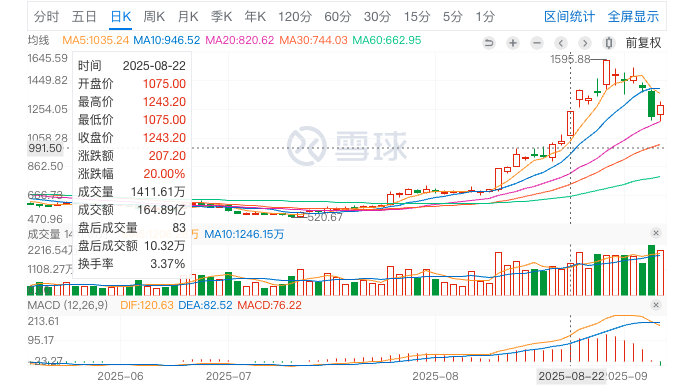

（嗷对，忘了，DeepSeek老板其实还是股民顶流……炒股才是人家本职工作，炼丹只是玩票……🤣）

我们这次不探究下一代国产芯片是什么，只想看看这个所谓的 **UE8M0 FP8** 是什么？

## 原始的出发点：INT 与 FP32

我们从源头开始复习一下计算机数据格式，以防有些同学已经忘了。

古典时代，计算机中存储数字包含两种格式：整数 INT（**Int**eger）和 浮点数 FP（**F**loating **P**oint），这个也是大多数学计算机/编程都要接触到的经典格式。

浮点数本质上就是把一个数字拆成三部分：符号位、指数、尾数。符号位决定正负，指数决定小数点的位置，尾数决定精度。

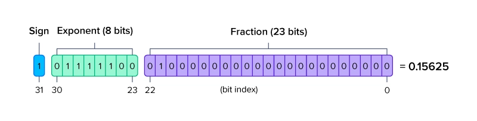

上图就是一个 FP32 的数据构成：22 位尾数，8 位指数，1 位符号位。其中的计算方式为：


$$
\begin{gather*}%不会产生编号
(-1)^{Sign} * 2^{(Exponent-127)} * (1 + \frac{fraction}{2^{23}})
\end{gather*}
$$

但是需要注意， 有2个特殊情况， 也就是上面说的指数位全0和全1的特殊用途。

**1）Exponent 全 0**

计算公式为

$$
\begin{gather*}%不会产生编号
(-1)^{Sign} * 2^{-126} * (\red0 + \frac{fraction}{2^{23}})
\end{gather*}
$$

实际上，当 Exponent 为 0 时，本身第二项的指数就是 \(2^0 - 127 = -126\)，真正有区别的是第三项中，那个默认的 "1" 没有了。
从\((1+\Delta)\)变成了 \((0+\Delta)\)。

**2）Exponent 全 1**

- 如果 Fraction 全 0 ， 则表示\(+\inf\)或者\(-\inf\)

- 如果 Fraction 不全为 0 ， 则表示\(NaN\)

所以我们来计算一下上图这个值

$$
\begin{gather*}%不会产生编号
(-1)^{1} * 2^{(124-127)} * (1 + \frac{2^{21}}{2^{23}}) \\
= (-1) * 2^{-3} * (1 + 0.25) \\
= (-1) * (0.125) * 1.25 \\
= -0.15625
\end{gather*}
$$

所以说上面那个图画错了，符号位反了，不信我们可以用 [工具](https://www.h-schmidt.net/FloatConverter/IEEE754.html) 验证一下：

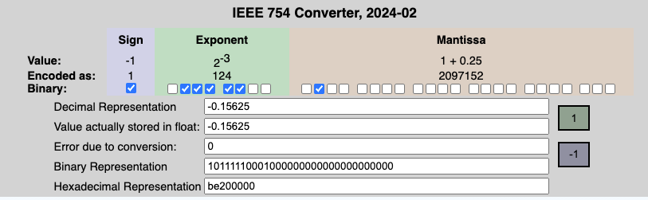

在很长一段时间里，FP32（32 位浮点数）是计算机的黄金标准，它精度高，范围广，几乎是科学计算、图像处理、AI 的通用方式。

## 搞那么精确干嘛：FP16 与 BF16

当大模型的参数量级膨胀到数千亿甚至万亿，FP32 就显得臃肿了。每一条权重都要用 32 位去存，显存根本不够用，训练时间也被拖长。

所以干脆把精度降低一些，又不是不能用🤨

    

由此有了 FP16 与 BF16

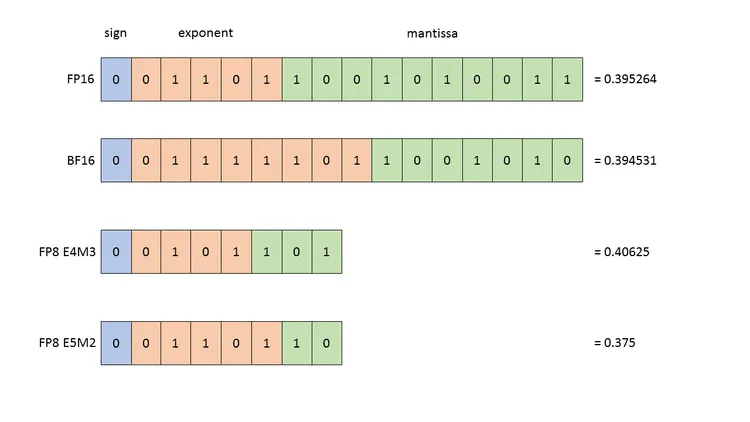

FP16 就是一般的 16 位浮点数数据格式，而 BF16 是 Google Brain 提出的专门为深度学习和高性能计算设计，旨在兼顾计算效率与数值范围的一种16位浮点数格式。

BF16 的全称是 **Brain Floating Point 16**（这个 Brain 就是指 Google Brain）。

搞 BF16 是因为 Google Brain 的团队在实践中意识到：在深度学习训练中，**数值的动态范围（由指数位决定）比极高的精度（由尾数位决定）更重要**。梯度、激活值等张量可能包含非常小或非常大的数值。如果数值范围不够（如传统 FP16），就容易出现下溢（变成零）或上溢（变成无穷大），导致训练不稳定甚至失败。

而且如果我们仔细观察 BF16 会发现，它**具有和 FP32 相同的指数位与符号位（1 位符号位，8 位指数位）**，这说明 BF16 其实是 FP32 的一种 “子集”——转化起来很方便，把尾数扔了可以直接用。

这样做就能够抛弃掉之前常用的 FP32 FP16 混合精度训练那一套麻烦的东西，而大大简化了流程。

## 更进一步：FP8

FP8 是一种 8 位浮点数表示法，FP8 的详细介绍可以 [参考链接](https://docs.nvidia.com/deeplearning/transformer-engine/user-guide/examples/fp8_primer.html#Introduction-to-FP8)。
FP8 采取 E4M3 和 E5M2 两种表示方式，其中 E 代表指数位（Exponent），M 代表尾数位（Mantissa）。
在表示范围内，E4M3 更精准，而 E5M2 有更宽的动态范围。 
与传统的 FP16（16位浮点数）和 FP32（32 位浮点数）相比，它显著减少了存储，提高了计算吞吐。

数据表示位数的降低带来了更大的吞吐和更高的计算性能，虽然精度有所降低，但是在 LLM 场景下，采用技术和工程手段，FP8 能够提供与更高精度类型相媲美的结果，同时带来显著的性能提升和能效改善。

下面这张图（原谅我原图就这么糊）是 Gemma 在不同的 8 卡机配置下，不同的数据格式的吞吐量对比。
横轴代表的是某个端到端的时间限制，纵轴代表的是吞吐量。

    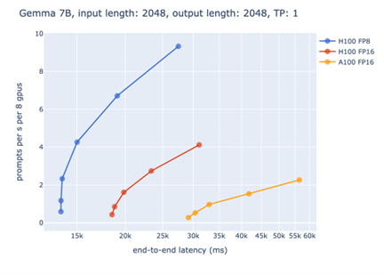
    

        <i>source: https://developer.nvidia.com/zh-cn/blog/fp8-precision-performance/</i>
    

对于生成式模型的性能评测，不能够单纯的只考虑吞吐量或是延迟。如果只追求吞吐量，导致延迟太长，会让使用者有不好的体验；相反的，如果只考虑延迟，则会导致没办法充分利用硬件资源，造成浪费。

因此，常见的评测条件是：**在一定的延迟限制下，达到最大的吞吐量**。

以上图为例，如果将端到端的时间限制设为 15 秒，则**只有 FP8 能够满足要求**，这展示了在一些对延迟限制比较严格的场景下，FP8 加速带来的重要性。

而在 20 秒这个时间限制下，都使用 Hopper GPU 进行推理时，FP8 对比 FP16 在吞吐量上能够带来 **3 倍以上**的收益。

这是由于 FP8 能够在相同的时间限制下使用更大的 batch size，从而有更好的 GPU 利用率，达到更高的吞吐量。

额外提一句，用 FP8 来训练之前大家一直都想做。因为当时推理已经能够用 FP8 来进行推理了，如果 FP8 能够用来训练，那么训练出来的结果：

1. **性能会更好**：因为你的训练优化目标和推理评测目标一致，没有把 FP32/FP16 转到 FP8 带来的额外误差。
2. **流程会更简单**：训练推理都统一用 FP8，不用额外的转换步骤。

但是大家的训练一直不是特别稳定，也有人怀疑 FP8 是否真的足以承载 LLM 的训练。直到 DeepSeek 出场，直接用 FP8 训了 DeepSeekV3，走通了整条路子，大家才明白：这条路子确实可行！

这也是为什么 DeepSeekV3 当时说自己的成本特别低的原因，确实是更先进、更完善的基础设施以及训练架构。

## 推理更快：INT8 与 INT4

在推理侧，为了追求极致的速度，一个常用的方法是将其进行量化。将原本浮点数表示的参数量化为用整数表示的参数，如 INT4, INT8 等，有以下几个原因：

整数运算（尤其是8位整数）在硬件层面比浮点数运算要简单得多。

* **浮点数的结构**：一个浮点数由符号位、指数位和尾数位组成。进行乘法或加法时，硬件需要分别处理指数和尾数，包括对齐指数、规格化结果等复杂步骤。这需要更多的晶体管和时钟周期。

* **整数的结构**：一个整数就是简单的二进制补码形式。乘法或加法就是直接的位运算，逻辑非常简单，所需的晶体管数量和时钟周期远少于浮点运算。

**结果就是**：在同一块硬件上，处理器在一个时钟周期内可以完成 **更多次** 的整数运算。这意味着计算吞吐量（Throughput）显著提高。

另一个方面，现代CPU、GPU和专用的AI加速器（NPU/TPU）都内置了针对低精度整数计算的专门指令集和硬件单元。

* **SIMD指令**：例如，在x86架构的CPU上，AVX-512指令集可以一次处理64个`INT8`数，但只能一次处理16个`Float32`数。这意味着单条指令的“计算密度”提高了4倍。
* **专用硬件单元**：许多AI芯片设计了专门的矩阵运算核心（Tensor Cores, NPU Cores），这些核心对`INT8`甚至`INT4`操作进行了极致优化，能够以极高的能效比执行大规模的乘加运算。直接使用这些硬件单元的前提就是将模型量化为整数格式。

如果不做量化，就无法利用这些强大的专用硬件能力。

量化的方式不过多介绍，这里仅介绍最简单的对称量化：

以`FP32`量化到`INT8为`例，量化的行为是想用 8 位的整型去表示 32 位的浮点数。
但是 8 位整型最大可表示范围为 \(2 ^ 8 = 128\)，是远小于 FP32 的表示范围的。如果本身这个 FP32 浮点数大于 128 怎么办？

我们就可以引入一个缩放系数`k`。
我们在量化时可以知道原本的 FP32 的所有值，自然也就可以知道其中的最大值和最小值。
因此我们就可以把 FP32 从最大值到最小值这一段范围映射到 INT8 能表示的 -127~128 上。
这个映射非常简单，只需要乘一个缩放系数`k`就可以了。记 FP32 最大值最小值分别为`min_val`和`max_val`实现时，为了方便一般会这么计算：

$$
k = \frac{\max( abs( \text{min\_val} ), abs( \text{max\_val} ) ) }{127}
$$

其中\(abs(\cdot)\)是绝对值函数，这样现有的一个值就会计算为

$$
INT8\_val = round(\frac{ FP32\_val }{k})
$$

推理时，只需要多加一步转换为近似值即可。这个过程被称为反量化：

$$
FP32\_val\_approx = INT8\_val \times k
$$

比如，假设有一组 FP32 数值：[-2.5, -1.2, 0.3, 1.8, 2.1]，计算步骤为：

1. **确定范围**：min_val = -2.5, max_val = 2.1

2. **计算缩放因子**：scale = max(|-2.5|, |2.1|) / 127 = 2.5 / 127 ≈ 0.0197

3. **量化转换**：
   
   * -2.5 / 0.0197 ≈ -127 → -127
   * -1.2 / 0.0197 ≈ -61 → -61
   * 0.3 / 0.0197 ≈ 15 → 15
   * 1.8 / 0.0197 ≈ 91 → 91

仔细观察可见，整数负数部分缩放比例相同，中心点在 0 位置，不需要额外增加偏移，所以叫做对称量化。

### FP8 VS INT8

回到正题，虽然 FP8 和 INT8 都是 8 位表示的数据，但是目前业内还是常用 INT8，这是因为：

1. **硬件支持的成熟度：INT8生态已高度优化**
   
   1. **专用指令集**：现代CPU/GPU/NPU（如ARM NEON、Intel AVX-512 VNNI、NVIDIA Tensor Core）对INT8的矩阵乘加（GEMM）操作有深度优化，甚至支持INT4/INT1等更低精度。而FP8的硬件支持相对较新（如NVIDIA Hopper架构才首次原生支持FP8）。
   2. **能效比**：整数运算单元（ALU）的电路设计比浮点运算单元（FPU）更简单，功耗更低。例如，在相同工艺下，INT8乘加器的面积和功耗可能仅为FP8的1/3-1/2，这对边缘设备至关重要。

2. **量化算法的稳定性：INT8的误差更容易控制**
   
   1. **浮点量化的非线性问题**：FP8需要动态调整指数位（exponent），而激活值的分布可能极端不均匀（例如Transformer中的异常值）。这导致：
      
      1. **动态范围分配困难**：指数位过少时，小数值精度损失严重；指数位过多时，大数值又无法覆盖。
      2. **校准复杂度高**：需统计每层张量的动态范围并调整缩放因子，容易引入累积误差。
   
   2. **整数量化的确定性** ：INT8通过统一的缩放因子（scale）和零点偏移（zero-point）将浮点映射到整数，算法更鲁棒。尤其是对称量化（zero-point=0）可进一步简化计算。

3. **软件栈的兼容性**：INT8工具链更完善
   
   1. **框架支持**：TensorRT、ONNX Runtime、TFLite等主流推理引擎对INT8的量化-反量化（Q/DQ）节点、图优化等已有多年打磨，而FP8的支持仍处于实验阶段。
   2. **部署成本**：转换现有FP32模型到INT8只需添加校准步骤，而FP8可能需要重新设计量化策略甚至微调模型。

## 按需压缩：MXFP8/6/4

23 年 9 月，一个叫做 OCP (Open Compute Project) 的组织就定义了一种新的数据格式：Microscaling Formats，这也就是后来颇受业内关注的数据格式 MX。

格式的具体定义可看 [OCP-MX-v1](https://www.opencompute.org/documents/ocp-microscaling-formats-mx-v1-0-spec-final-pdf)

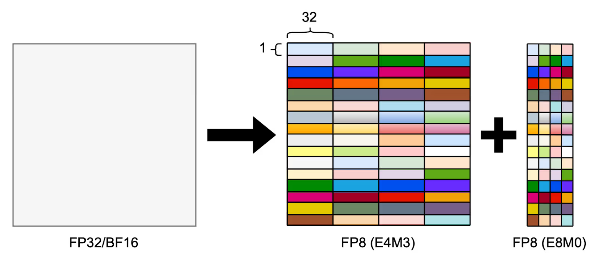

MX 数据格式的设计的核心思想是：**重新思考“缩放”**

### 传统量化的局限性

要理解MX，首先要明白传统量化的局限性。

* **传统量化（如标准INT8）**：使用按**张量（per-tensor）**或按**通道（per-channel）**的缩放因子（`scale`）。一个层或一个通道的所有数值都共享同一个缩放因子。
  
  * **缺点**：对于数值分布不均匀的张量（例如，Transformer模型中的激活值经常存在异常值），一个全局的缩放因子会导致精度严重损失。要么为了覆盖异常值而牺牲大多数普通数值的精度，要么截断异常值导致信息丢失。

* **Microscaling Formats (MX)**：将缩放因子应用到一个**更细的粒度**，通常是一组数值（a block of values），而不是整个张量。这个“组”可以是一行、一列或一个更小的块。
  
  * **核心思想**：**“微缩放”** 。通过为每个小数据块独立计算和使用缩放因子，可以更好地适应块内数值的局部动态范围，从而在保持低比特位宽的同时，显著减少量化误差。

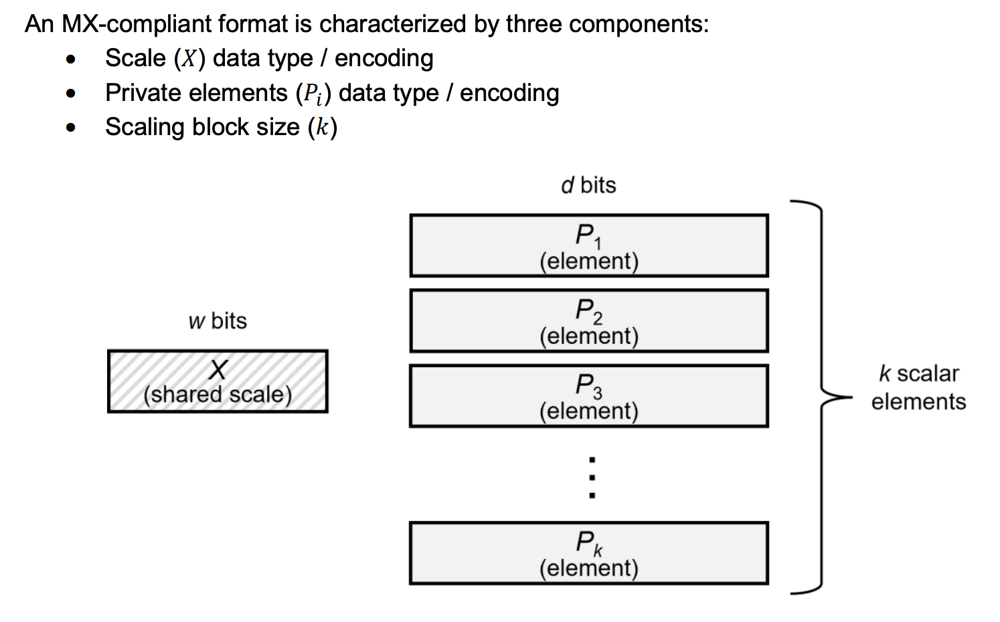

MX是一个格式家族，其中最常见和著名的代表是：

1. **MXFP (Microscaling Floating Point)**
   
   * **结构由两部分组成**：
     
     1. **共享指数（Shared Exponent）**：一个数据块（例如，16个数值）共享一个指数值（通常用8位表示）。
     2. **低比特尾数（Low-Bit Mantissas）**：块内的每个数值只用很少的位数（如4位、3位或2位）来存储其尾数（ mantissa）和符号位。
   
   * **工作原理**：
     
     * 对于一个块内的所有FP32数值，找到绝对值最大的那个数，提取它的指数作为该块的 **共享指数**。
     * 然后，将块内每个数值转换为相对于这个共享指数的 **偏移尾数**。
     * 这样，存储时只需要存储一个共享指数（8位）和N个低比特尾数（如4x16=64位），极大地压缩了数据。
   
   * 示例 ：`MXFP8` (4-bit mantissa) 或 `MXFP6` (3-bit mantissa) 等。它本质上是 **块内共享指数的浮点格式**。

2. **MXINT (Microscaling Integer)**
   
   * **结构同样由两部分组成**：
     
     1. **共享缩放因子（Shared Scale）**：一个数据块共享一个浮点缩放因子（`scale`）。
     2. **低比特整数（Low-Bit Integers）**：块内的每个数值被量化为一个低比特整数（如4位、3位或2位）。
   
   * **工作原理**：
     
     * 与传统INT8量化逻辑类似，但缩放因子是 **每块（per-block）** 的，而不是每张量或每通道的。
     * 对于一个块，根据块内数值的最大最小值计算出一个最优的缩放因子。
     * 然后使用这个因子将块内所有浮点值量化为低比特整数。
   
   * **示例**：`MXINT8` (常规INT8是它的特例，其“块大小”为整个张量)，`MXINT4`, `MXINT3`等。它本质上是 **块级缩放的整数格式** 。

### MX 与传统格式的对比

下表对比了传统格式和 MX 格式的特点

| 特性         | 传统格式 (FP16, INT8)                | MICROSCALING FORMATS (MXFP9, MXINT4) |
| ---------- | -------------------------------- | ------------------------------------ |
| **缩放粒度**   | **粗粒度**(Per-Tensor, Per-Channel) | **细粒度**(Per-Block, e.g., 16 values)  |
| **动态范围适应** | 差。难以处理不均匀分布和异常值。                 | **优秀**。每个小块独立适应自己的动态范围，对异常值不敏感。      |
| **精度保持**   | 在复杂模型中精度损失可能较大。                  | **更高**。在相同甚至更低比特位宽下，能保持更高的模型精度。      |
| **硬件友好性**  | **非常好**，已广泛集成于NPU/GPU中。          | **新兴支持**。需要新的硬件指令来高效处理块级操作。          |
| **主要优势**   | **成熟、稳定、通用性强**。                  | **极致压缩率与精度平衡**，特别适合前沿大模型。            |

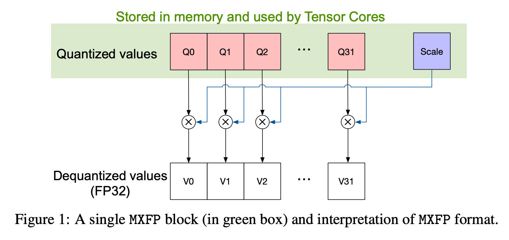

### MX格式解决了什么问题？

* **突破“异常值难题”**：Transformer等现代神经网络架构的激活值中普遍存在异常值，这是阻碍更低比特量化（如INT4）的主要障碍。MX格式通过微缩放完美地解决了这一问题，使得4比特甚至3比特量化变得可行。

* **极致的内存节省**：
  
  * `MXFP4`：1个共享指数(8b) + 16个4位尾数 = `8 + 16*4 = 72 bits` 存储16个值。
  * 平均每个值仅占 `72/16 = 4.5 bits`！这比FP16减少了约 **72%** 的内存占用和带宽需求。

* **更高的计算密度**：数据位宽越低，在同一硬件上每个时钟周期能执行的操作就越多（Ops/cycle），从而提升吞吐量。

### MX 的应用与支持

* **应用场景**：主要用于大型语言模型(LLMs)、推荐系统等对内存带宽极其敏感的场景的推理甚至训练。
* **硬件支持**：这是关键。高效的MX格式计算需要新的硬件指令集来加速“块加载、共享因子应用、元素乘加”这一流程。
  * NVIDIA的Hopper GPU及其Transformer Engine已经开始支持类似MX思想的格式（如FP8），但更激进的MX格式（如MXINT4）是下一代AI芯片竞争的焦点。
  * AMD的MI300系列及后续产品也在朝这个方向发展。
  * 许多初创AI芯片公司直接将MX格式作为其架构设计的核心。

### 小结

对这一节做个小结：**Microscaling Formats (MX)** 代表了超越传统整数量化的下一代低精度技术。其核心创新在于：

> 将缩放因子应用到更细粒度的数据块级别，从而在极致压缩数据位宽的同时，最大限度地保留模型的精度。 

它不是为了取代INT8，而是为了开启通往`INT4/3/2`世界的大门，是推动更大、更复杂的模型在资源受限的设备上部署的关键使能技术。随着硬件支持的逐步完善，MX格式有望成为未来边缘AI和云端AI推理的新标准。

在 "[更进一步：FP8](#DeepSeek_FP8)" 一节我们有提到，大家都有想使用 FP8 进行训练，最终是 DeepSeek 第一个走通了这条技术路径。

在 NVIDIA 的这篇文章 [Recipes for Pre-training LLMs with MXFP8](https://arxiv.org/pdf/2506.08027) 中有给出一些使用 FP8 训练的实操经验，其中提到了几个关键点：

* 所有的数据（包括激活值的梯度）都用 MXFP8-E4M3 格式
* 用 UE8M0 的值来表示 scale，并且对数据做上取整。

顺带一提，Cursor 作为一个应用厂商也自己重写了 MXFP8 的计算 kernel，并在 MoE 训练上获得了可观的速度提升

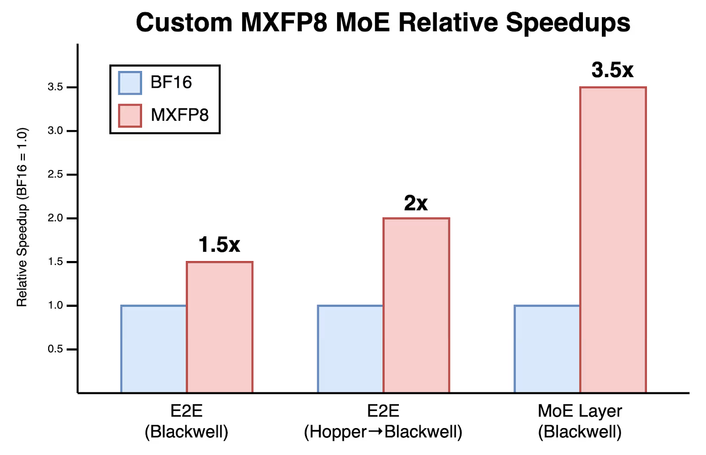

具体结果可见 [1.5x Faster MoE Training with Custom MXFP8 Kernels](https://cursor.com/en/blog/kernels)

## 未来的另一块拼图：UE8M0

细心的读者已经看到了，讲上面一节的时候，已经看到了一个新的格式 E8M0。根据之前的内容，我们很容易推断出来，这个格式是：8 位指数 0 位尾数的数据格式。

大家用这样的格式来作为那个共享 scale 的精度格式。
而前面的 U 指的大概就是 Unsigned 无符号数，很合理，本身 Scale 也只是衡量数据的尺度，和正负号（数据的方向）没有啥关系。
数据的方向由前面的 FP8 或 FP4 中的符号位标识：

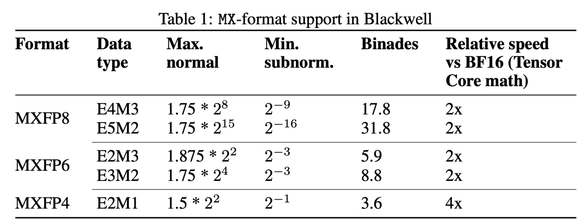

话说为什么要这么去设计这个共享 Scale？

**硬件代价低**：UE8M0 只编码 2^k，**移位即可，关键路径短、功耗低**；对没有完整 FP8 乘加单元的芯片，落地门槛更低。

也就是说，比如我存储一个 block (32位，根据具体定义来) 的 FP8 E4M3，然后我再存一个他们的共享 Scale。

因为 Scale 是一个无符号指数表示的整数。因此量化时我只需要把原来的数根据 Scale 进行移位就好，而还原时也只需要反方向进行移位。

具体使用的时候：

一般数据仍然记录为 **E4M3/E5M2**（通常 E4M3 全程更稳），**共享指数 Scale 用 UE8M0**；典型块大小 `K=32`，这就是 **MXFP8**。

对于不同的层，一般来说：

* **权重/激活/梯度在 GEMM/CONV** 里用 **MXFP8**
* **归一化/softmax/残差**等用 **BF16/FP32**
* 累加一般在 **FP32**
* **主权重**常保一份 **FP32 “母本”**。

缩放算法按块取 `amax` 决定指数，**向上取整** 以避免溢出，再做饱和式量化（超过上限就记为最大值）。
具体参见 [Recipes for Pre-training LLMs with MXFP8](https://arxiv.org/pdf/2506.08027) ，里面给了具体步骤与对比。

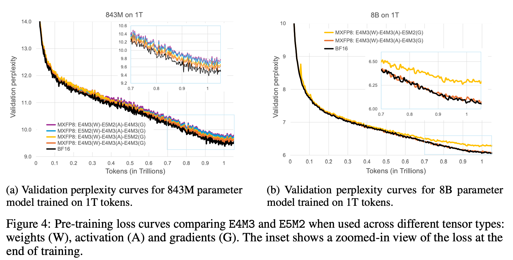

上图来看，在更大的模型 (8B) 上，使用 E4M3 的精度已经基本上能和 BF16 接近，达到同样的效果。与此同时，却能达到 2 倍的训练速度。

## 总结

本文从浮点精度基础开始，简要介绍了大模型领域几种常见的数据精度格式，及其发展脉络。

看完全文，我们也就能对开头的那个问题 “UE8M0 是什么“ 进行回答


UE8M0 其实不是一种新的数据格式。
它是用来和 E4M3 等数据格式协同使用，构成 MXFP8 等数据格式的一种辅助数据格式。
这样的数据格式是为了在不过多影响最终性能的情况下，大幅提升大模型训练、推理的速度。


## Reference

[1] https://www.exxactcorp.com/blog/hpc/what-is-fp64-fp32-fp16

[2] https://mp.weixin.qq.com/s/KeSqzVvoYot9bf2YQ5V46A

[3] https://developer.nvidia.com/zh-cn/blog/fp8-precision-performance/

[4] https://www.opencompute.org/documents/ocp-microscaling-formats-mx-v1-0-spec-final-pdf

[5] https://wallstreetcn.com/articles/3753982

[6] https://arxiv.org/pdf/2506.08027
